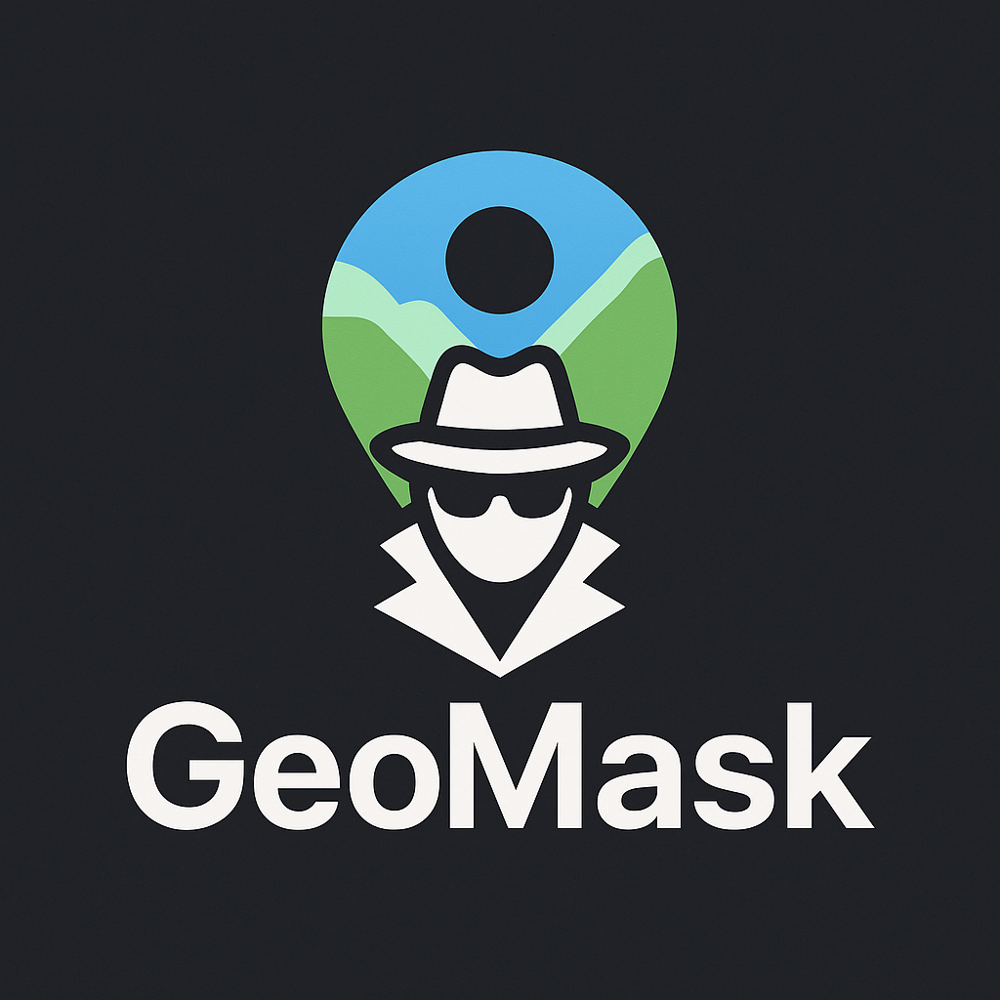
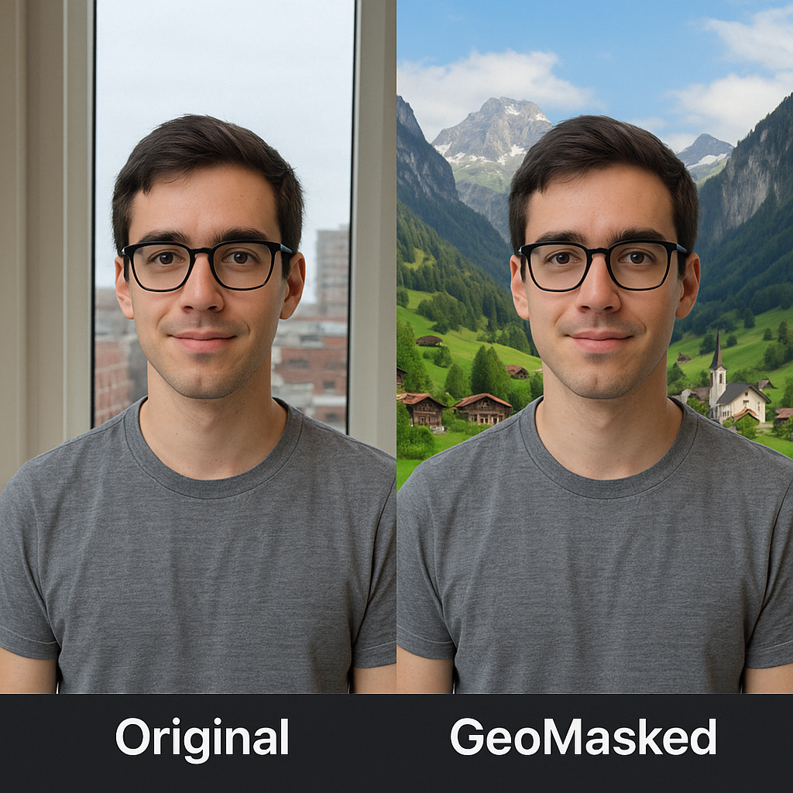

# GeoMask 🗺️🕵️‍♂️

**Protect your privacy from AI-powered GeoGuessr tools.**



GeoMask lets you upload photos intended for social media, then automatically replaces the identifiable background view (e.g., your window's scenery) with a decoy — a different city, a Swiss mountain village, or a custom scene of your choice.

---

## 🚀 Features

* 🌐 Replace window views with AI-generated decoy locations
* 🏙️ Choose from presets: cityscapes, nature, mountains, seaside, etc.
* 🔒 Prevent AI-based geolocation or doxxing
* 🖼️ High-resolution output ready for social media
* 🧠 Powered by local or cloud-based AI image generation

---

## 💻 Tech Stack

* **Backend**: Python (FastAPI), OpenAI API, OpenCV, PIL
* **Frontend**: React, Styled Components, Framer Motion
* **AI**: OpenAI DALL-E, Stable Diffusion (optional)
* **Deployment**: Docker, Docker Compose
* **Testing**: Pytest, React Testing Library

---

## 📦 Installation

### Quick Start

```bash
git clone https://github.com/makalin/GeoMask.git  
cd GeoMask  
chmod +x scripts/start.sh
./scripts/start.sh
```

### Manual Setup

```bash
# Backend
pip install -r requirements.txt
cp env.example .env
# Edit .env with your OpenAI API key
uvicorn app.main:app --host 0.0.0.0 --port 8000 --reload

# Frontend (in another terminal)
cd frontend
npm install
npm start
```

### Docker Deployment

```bash
docker-compose up -d
```

---

## ⚡ Usage

1️⃣ **Upload** a photo with a window or background you want to mask
2️⃣ **Choose** a decoy scene or let GeoMask randomize it  
3️⃣ **Download** the protected photo — ready for posting!

---

## 🌟 Example

See the power of GeoMask in action:



*Left: Original photo with identifiable background | Right: GeoMasked version with AI-generated decoy scene*

---

## 🛡️ Why GeoMask?

Modern AI tools can analyze window views, skyline patterns, and environmental cues in photos to guess your location — sometimes within meters. GeoMask ensures your privacy by swapping these views with decoy scenes.

### How It Works

1. **Window Detection**: Automatically identifies windows and background areas
2. **AI Generation**: Creates realistic replacement backgrounds using AI
3. **Seamless Blending**: Merges the new background with your original photo
4. **Privacy Protection**: Your location remains hidden from AI analysis

---

## 🔧 Development

```bash
# Install development dependencies
make install-dev

# Run tests
make test

# Format code
make format

# Lint code
make lint

# Start development servers
make start
```

---

## 📚 Documentation

- [API Documentation](docs/API.md) - Complete API reference
- [Deployment Guide](docs/DEPLOYMENT.md) - Production deployment instructions
- [Project Structure](PROJECT_STRUCTURE.md) - Detailed project overview

---

## 🌟 Features in Detail

### Scene Types
- **Random**: AI chooses from various locations
- **City**: Urban cityscapes and skyscrapers
- **Mountain**: Swiss alpine villages and peaks
- **Beach**: Tropical beaches and coastal views
- **Forest**: Dense forests and natural landscapes
- **Desert**: Desert landscapes and dunes
- **Custom**: Your own scene description

### Technical Features
- **Real-time Processing**: Fast image processing with progress feedback
- **High Quality Output**: 8K resolution support with professional quality
- **Secure Processing**: Files are processed securely and not stored permanently
- **Multiple Formats**: Supports JPEG, PNG, GIF, BMP, TIFF, WebP
- **Responsive Design**: Works on desktop, tablet, and mobile

---

## 📄 License

MIT License - see [LICENSE](LICENSE) file for details.

---

## 🤝 Contributing

We welcome contributions! Please:

1. Fork the repository
2. Create a feature branch (`git checkout -b feature/amazing-feature`)
3. Commit your changes (`git commit -m 'Add amazing feature'`)
4. Push to the branch (`git push origin feature/amazing-feature`)
5. Open a Pull Request

### Development Setup

```bash
# Clone and setup
git clone https://github.com/makalin/GeoMask.git
cd GeoMask
make setup

# Install dependencies
make install-dev

# Run tests
make test

# Start development
make start
```

---

## 🆘 Support

- **Issues**: [GitHub Issues](https://github.com/makalin/GeoMask/issues)
- **Documentation**: [docs/](docs/) directory
- **API Reference**: [docs/API.md](docs/API.md)

---

## 🙏 Acknowledgments

- OpenAI for DALL-E image generation
- FastAPI for the excellent web framework
- React community for the amazing frontend ecosystem
- OpenCV for image processing capabilities
